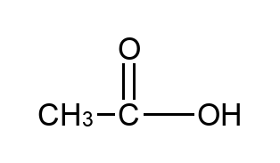
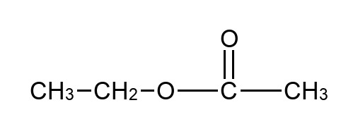
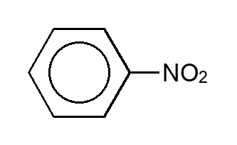
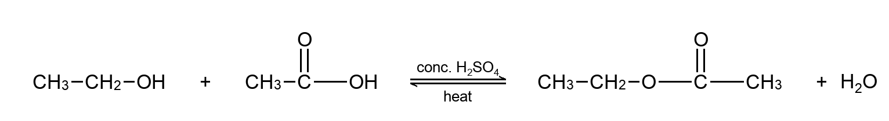
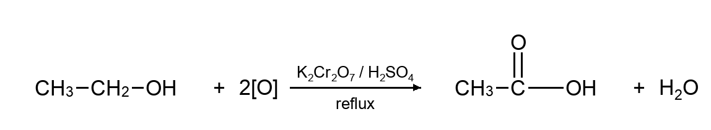

# SMILES-to-vector renderer

Turn a SMILES string into a sharp vector drawing of a chemical structure, or compose a whole reaction scheme, as SVG (with a PNG fallback). RDKit parses the SMILES; a custom layout pass draws it in the condensed structural style used in teaching and reference material, rather than the fully expanded skeletal form a generic renderer produces.

## Examples

Every image below was produced by the renderer itself. Regenerate them with `python3 examples/render_examples.py`.

**Structures.** Chains, common functional groups, and substituted benzene rings:





**Reactions.** Multiple species, reagent above and conditions below the arrow, and an equilibrium arrow where the chemistry calls for one:





## What it does

- **SMILES to vector.** Parses with RDKit, then lays the molecule out with a horizontal backbone, carbonyls drawn upward, and every hydrogen shown, matching the condensed convention.
- **Sharp SVG output.** Vector, so it stays crisp at any size. A raster PNG fallback is available through the same call.
- **Reaction schemes.** Composes several species into one drawing with reagent and condition text set over the arrow, straight or equilibrium arrows, formal charges, and built-up fractions for half-equation coefficients.
- **Direct Word export.** Writes the vector drawing straight into a `.docx`. See the note below on how, because it is the part I am most pleased with.

## Install

```bash
pip install -r requirements.txt
```

Requirements are `rdkit` and `pillow`, plus `python-docx` for Word export. CI supports Python 3.11 through 3.13. The renderer uses Arial when it is installed and falls back to Liberation Sans or DejaVu Sans on other platforms. Reference-image byte comparisons run only with Arial; the cross-platform gate asserts stable chemical and artifact semantics instead of font-dependent pixels.

## Usage

```python
import structure_svg as svg
markup, width, height = svg.render_svg("CC(=O)O")     # ethanoic acid, returns an SVG string

import structure_draw as draw
draw.render("CC(=O)O", "ethanoic-acid.png")           # write a PNG instead

import reaction_render as rxn
markup, width, height = rxn.render_reaction_svg(
    ["CCO", "CC(=O)O"], ["CCOC(C)=O", "$H2O"],
    reagent="conc. H2SO4", conditions="heat", arrow="<=>",
)

from embed_docx import build_doc
build_doc([("ethanoic acid", "CC(=O)O"), ("benzene", "c1ccccc1")], "structures.docx")
```

In a reaction, most species are SMILES. A species that is not, an inorganic reagent, an ion, a radical, or a coefficient, is written as a literal token with a leading `$`, for example `$H2O`, `$2[O]`, `$Na^+`, `$conc. HCl`. Digits after a letter auto-subscript, so `$H2SO4` prints as H₂SO₄. The `$` marks the token and is not drawn. Reagent and condition text are plain formula text and take no `$`.

## Input validation

Every public structure and reaction entry point validates a structural species before layout. Kekule accepts one connected SMILES string for a simple acyclic or single-ring molecule. It does not convert chemical names to SMILES.

Invalid or unsupported input raises a typed `ValueError` subclass from `structure_draw`:

- `InvalidSmilesError` for malformed SMILES or a chemical name passed as SMILES.
- `DisconnectedStructureError` for salts, mixtures, or other dot-disconnected SMILES. In a reaction, pass separate species as separate list entries, or use an explicit `$` literal token.
- `UnsupportedTopologyError` for multi-ring, fused, bridged, or spiro structures.
- `UnsupportedRadicalError` while structural radical-dot rendering is unsupported. Radicals may still be typeset explicitly as reaction literals such as `$•CH3`.
- `UnsupportedStereochemistryError` when a specialised stereo request cannot be represented faithfully. The raster stereo-pair helper supports exactly one tetrahedral stereocentre and draws both enantiomers; it does not select one configuration from `@` or `@@`. Multi-centre stereo is rejected, and wedge/dash stereo SVG is outside the supported scope.

All of these inherit from `KekuleInputError`, so callers may catch either the specific condition or the shared base class.

## Scope

The layout engine targets acyclic molecules (chains with one functional group and simple branches) and simple single-ring structures, including single-benzene-ring derivatives. Fused, bridged, spiro, and other multi-ring systems are outside its supported scope and are rejected before layout.

## Readiness gate

Run the complete local preview gate with one command from the repository root:

```bash
python3 scripts/readiness_gate.py
```

This compiles the Python sources, runs the 66-case geometric invariant suite, runs the 29 validation tests, and executes every case in [`evaluation/preview_manifest.json`](evaluation/preview_manifest.json), including the portable DOCX package smoke. The manifest is the single human-readable inventory of supported preview examples and typed rejection cases; the runner contains only generic entry-point dispatch and semantic artifact checks. GitHub Actions installs the declared dependencies and invokes this same command on Python 3.11, 3.12, and 3.13.

## Licence

[MIT](LICENSE)
